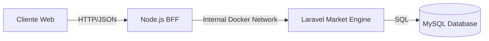

# 🚀 Ecosystem Fintech Monolith

Un sistema distribuido basado en microservicios para la simulación y monitoreo de mercados financieros en tiempo real.


# 🏗️ Arquitectura del Sistema

El proyecto implementa una arquitectura desacoplada utilizando el patrón **BFF (Backend for Frontend)** para orquestar la comunicación entre servicios.




## Servicios

Frontend (React + Vite): Interfaz de usuario reactiva para la visualización de datos.

Ecosystem BFF (Node.js): Capa de agregación y proxy que desacopla el cliente de los servicios de dominio.

Market Engine (Laravel): Microservicio Core encargado de la lógica de negocio, gestión de activos y persistencia.

Database (MySQL 8): Capa de persistencia relacional.


# 🔧 Requisitos Previos

· Docker Desktop (corriendo)

· Git


# 🚀 Instalación y Despliegue

Este proyecto utiliza Docker Compose para orquestar todo el entorno con un solo comando. No necesitas instalar PHP, Node o MySQL en tu máquina local.


## 1. Clonar el repositorio

```
git clone <url-del-repo>
cd monolito-app
```

## 2. Configurar Variables de Entorno

El proyecto ya incluye configuraciones por defecto para desarrollo local en docker-compose.yml. Asegúrate de que los puertos 3000, 5173, 8000 y 3306 estén libres.

## 3. Levantar el Ecosistema

```
docker-compose up -d --build
```

## 4. Inicializar Datos (Seed)

```
docker exec -it ecosystem-engine php artisan migrate:fresh --seed
```


# 📍 Endpoints & Acceso

| Servicio | URL Local | Descripción |
| :--- | :--- | :--- |
| **Frontend** | `http://localhost:5173` | Dashboard Principal |
| **BFF API** | `http://localhost:3000/api/market` | Endpoint público para el cliente |
| **Engine API** | `http://localhost:8000/api/market-data` | API Interna (Solo accesible vía Docker Network) |


# 🧠 Desafíos Técnicos Resueltos

## Docker Networking & Service Discovery
Se configuró una red interna (app-network) para permitir la resolución de nombres DNS entre contenedores. Esto soluciona la comunicación entre el BFF (Node) y el Engine (Laravel) utilizando http://market-engine:8000 en lugar de direcciones IP volátiles o localhost.

## Persistencia de Datos
Se implementaron volúmenes de Docker (dbdata) para garantizar que los datos de MySQL persistan entre reinicios del contenedor.

## Patrón BFF
Se utilizó Node.js como intermediario para:

 1. Ocultar la arquitectura del backend al cliente.

 2. Transformar y limpiar los datos antes de enviarlos al Frontend.

 3. Manejar errores de conexión con el servicio Core (Failover).


# 🛠️ Comandos Útiles

## Ver logs del sistema:

```
docker-compose logs -f
```

## Reiniciar todo desde cero (Wipe total):

```
docker-compose down -v
docker-compose up -d --build
```

## Acceder a la terminal de Laravel:

```
docker exec -it ecosystem-engine bash
```

Hecho con ❤️ y mucho ☕.